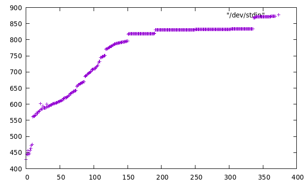
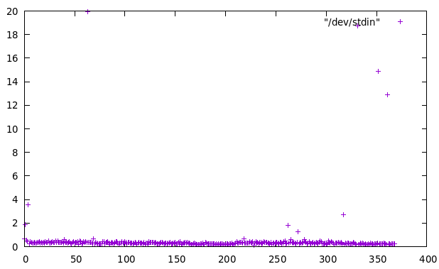

# About

Benchmark and alysis for the [Confluent Schema Registry](https://github.com/confluentinc/schema-registry/tree/v7.3.1).

# How the analysis works

- Start 1 kafka broker, 1 zookeeper and 1 schema registry: `docker-compose up`
- Benchmark for shell script `./create-schemas.sh 100000`:
  - Register 100000 different schemas to schema registry
  - Log heap usage (jmap -histo) and docker memory usage (docker stats)
- We register the same Avro schema with a custom field that counts up the iterations (`test.field=%iteration%`)
  - The json representation schema contains `355 characters` and therefore has a UTF encoded size of `355 * 1 Byte = 355 Byte`

```
// Test schema
{
  "type": "record",
  "name": "MyRecord",
  "fields": [
    {
      "name": "first_name",
      "type": "string"
    },
    {
      "name": "last_name",
      "type": "string"
    },
    {
      "name": "address",
      "type": "string"
    },
    {
      "name": "zip",
      "type": "int"
    },
    {
      "name": "country",
      "type": {
        "type": "enum",
        "name": "country_enum",
        "symbols": [
          "DE",
          "AU"
        ]
      }
    },
    {
      "name": "interests",
      "type": {
        "type": "array",
        "items": "string"
      }
    }
  ],
  "test.field": "040575"
}

```
 
# Blackbox analysis: findings

- The schema registry has an upper bound of `2^31-1` schemas it can hold (due to using a java integer for schema ids + negative numbers not being allowed for ids)

```
curl localhost:8081/subjects/my-subject/versions/-12
-> {"error_code":42202,"message":"The specified version '-12' is not a valid version id. Allowed values are between [1, 2^31-1] and the string \"latest\""}
```

- The schema registry needs to hold all schemas in memory
  - This means that the number of registered schemas increase the required memory of the jvm process
  - When looking into the heap this is confirmed - it consists of byte + json representations of schemas, and the concurrent hashmaps used for caching them

```
// Top 20 for 36.000 published schemas:
 num     #instances         #bytes  class name (module)
-------------------------------------------------------
   1:        641162       44399800  [B (java.base@11.0.17)
   2:        526128       37881216  org.apache.avro.JsonProperties$2
   3:        597081       14329944  java.lang.String (java.base@11.0.17)
   4:        562319       13495656  java.util.concurrent.ConcurrentLinkedQueue$Node (java.base@11.0.17)
   5:        526288       12630912  java.util.concurrent.ConcurrentLinkedQueue (java.base@11.0.17)
   6:        216000       10368000  org.apache.avro.Schema$Field
   7:        304915        9757280  java.util.HashMap$Node (java.base@11.0.17)
   8:        134334        9067288  [Ljava.util.HashMap$Node; (java.base@11.0.17)
   9:         72345        6457584  [Ljava.util.concurrent.ConcurrentHashMap$Node; (java.base@11.0.17)
  10:        148686        5947440  java.util.LinkedHashMap$Entry (java.base@11.0.17)
  11:        165618        5299776  java.util.concurrent.ConcurrentHashMap$Node (java.base@11.0.17)
  12:        160596        5139072  org.apache.avro.Schema$StringSchema
  13:         90344        5059264  java.util.LinkedHashMap (java.base@11.0.17)
  14:        104391        4757256  [Ljava.lang.Object; (java.base@11.0.17)
  15:         81327        3903696  java.util.HashMap (java.base@11.0.17)
  16:          6529        2522240  [I (java.base@11.0.17)
  17:         36651        2345664  java.util.concurrent.ConcurrentHashMap (java.base@11.0.17)
  18:        144535        2312560  java.lang.Integer (java.base@11.0.17)
  19:         72000        2304000  org.apache.avro.Schema$LockableArrayList
  20:        135577        2169232  com.fasterxml.jackson.databind.node.TextNode

```

- The increase of memory per schema is linear and lower than could be assumed when just looking at the first 1000 registered schemas
  - There is an exponential increase until ~150k schemas to ~ 850MiB of memory usage, after that the increase is marginal.
  - Between 33600 and 33700 registered schemas the graph jumps because of 34MiB memory increase for just 100 schemas.
```
cat logs/docker_usage.log | awk -v F=" " 'FNR > 1 {print $6}' | gnuplot -p -e 'plot "/dev/stdin"'
```



```
// What caused this jump?
04.02.2023-19:59:11 033600 17c20aee0821 schema-registry-tests_schema-registry_1 0.27% 834.1MiB / 31.33GiB 2.60% 76.3MB / 54.5MB 0B / 1.12MB 62
04.02.2023-19:59:46 033700 17c20aee0821 schema-registry-tests_schema-registry_1 0.29% 868.7MiB / 31.33GiB 2.71% 76.6MB / 71.5MB 0B / 1.12MB 63
```

- There is no noticeable increase of cpu usage
  - There are some spikes that might just have been caused by docker / my OS



- Performance impact of a schema registry holding many schemas:
  - Fetching: There is no noticeable performance penalty when the registry holds many schemas, fetching a schema is still "instant"
  - Registering: Registering new schemas becomes slower - this is not due to the schema registry itself, but due to the kafka replication:

```
// First schema registered takes ~ 80ms 
// -> 100 schemas take ~ 8s
[2023-02-04 17:05:43,743] INFO 192.168.128.1 - - [04/Feb/2023:17:05:43 +0000] "POST /subjects/my-subject/versions HTTP/1.1" 200 8 "-" "curl/7.68.0" 78 (io.confluent.rest-utils.requests)
[2023-02-04 17:05:43,805] INFO Registering new schema: subject my-subject, version null, id null, type AVRO, schema size 393 (io.confluent.kafka.schemaregistry.rest.resources.SubjectVersionsResource)
[2023-02-04 17:05:43,806] INFO Wait to catch up until the offset at 2 (io.confluent.kafka.schemaregistry.storage.KafkaStore)
[2023-02-04 17:05:43,806] INFO Reached offset at 2 (io.confluent.kafka.schemaregistry.storage.KafkaStore)
[2023-02-04 17:05:43,813] INFO Wait to catch up until the offset at 3 (io.confluent.kafka.schemaregistry.storage.KafkaStore)
[2023-02-04 17:05:43,816] INFO Reached offset at 3 (io.confluent.kafka.schemaregistry.storage.KafkaStore
...
// Schema 35.000 takes ~ 350ms 
// -> 100 schemas take ~ 35s
[2023-02-04 19:04:33,296] INFO 192.168.128.1 - - [04/Feb/2023:19:04:32 +0000] "POST /subjects/my-subject/versions HTTP/1.1" 200 12 "-" "curl/7.68.0" 341 (io.confluent.rest-utils.requests)
[2023-02-04 19:04:33,363] INFO Registering new schema: subject my-subject, version null, id null, type AVRO, schema size 393 (io.confluent.kafka.schemaregistry.rest.resources.SubjectVersionsResource)
[2023-02-04 19:04:33,372] INFO Wait to catch up until the offset at 34500 (io.confluent.kafka.schemaregistry.storage.KafkaStore)
[2023-02-04 19:04:33,372] INFO Reached offset at 34500 (io.confluent.kafka.schemaregistry.storage.KafkaStore)
[2023-02-04 19:04:33,631] INFO Wait to catch up until the offset at 34501 (io.confluent.kafka.schemaregistry.storage.KafkaStore)
[2023-02-04 19:04:33,631] INFO Reached offset at 34501 (io.confluent.kafka.schemaregistry.storage.KafkaStore)
```

# Whitebox analysis

Referring to version `v7.3.1`.

- The schema registry does not use a database or the file system, so the schemas are read once on initialization, then continuously on schema updates, and are all stored in memory.
  - Speculation: Probably because of performance so that producers/consumers don't have to suffer a cache miss. If there are few schemas (< 1000), nothing speaks against having all schemas in memory.

- Is there configuration that indicates a limit of registered schemas?
  - There are 2 parameters that refer to cache sizes: `SCHEMA_CACHE_SIZE_CONFIG` and `SCHEMA_CACHE_EXPIRY_SECS_CONFIG`
  - These parameters do not refer to the schemas themselves, but `RawSchema -> ParsedSchema`
    - The internal structure of a `ParsedSchema` is larger than the `RawSchema`, which is basically just the JSON Avro schema (and some more metadata)
  - The default size for the cache is `1000` with an expiration of `300s` 
    - If a `ParsedSchema` is not within the cache, it needs to be parsed again from the `RawSchema`
    - TODO: The investigation on effects of cache misses is another investigation